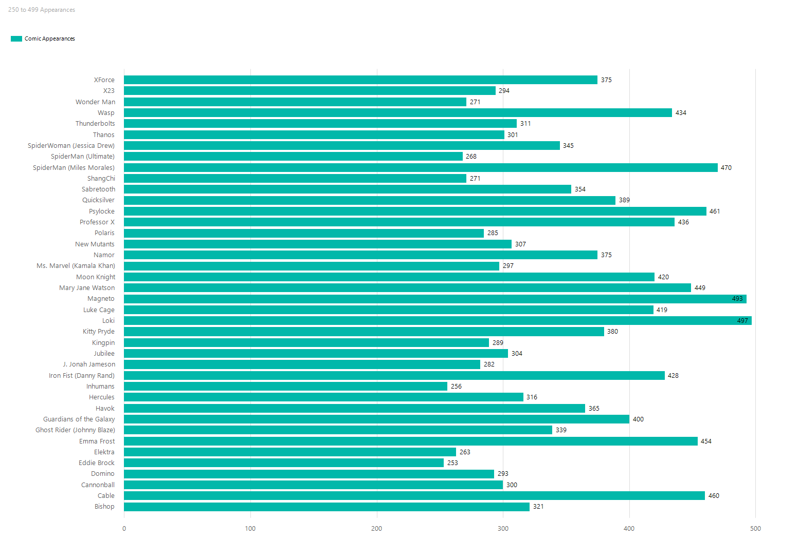

# Marvel Data Integration Project

This project pulls Marvel character data using the Marvel API, processes the data, and stores it in a Microsoft SQL Server database. It utilizes **SSIS** for ETL (Extract, Transform, Load) processes and **SSRS** for data visualization and reporting.

---

## Tech Stack

- **Programming Language**: Python 3.x
- **Database**: Microsoft SQL Server
- **Data Integration Tools**:
  - **SSIS (SQL Server Integration Services)**: For ETL processes to move and transform data.
- **Reporting**:
  - **SSRS (SQL Server Reporting Services)**: For creating reports from stored data.
- **Third-Party Libraries**:
  - `requests` - For making HTTP requests to the Marvel API.
  - `pyodbc` - For connecting Python to the SQL Server database.
  - `dotenv` - For managing environment variables.
- **Python Standard Libraries**:
  - `os` - For handling environment variables and paths.
  - `hashlib` - For hashing the API keys.
  - `datetime` - For working with timestamps.

---

## Setup and Installation

1. Clone this repository:

   ```bash
   git clone <repository-url>
   cd <repository-folder>
   ```

2. Install the required dependencies:

   ```bash
   pip install -r requirements.txt
   ```

3. Set up your `.env` file:

   - Create a file named `.env` in the root of the project.
   - Add the following keys:
     ```env
     PUBLIC_KEY=your_public_key
     PRIVATE_KEY=your_private_key
     DB_CONNECTION=your_database_connection_string
     ```

4. Set up your SQL Server database:

   - Open the `sql/characters.sql` file in this repository.
   - Run the script in your SQL Server Management Studio (SSMS) or any SQL client to create the required database table.
   - Note: This script assumes you already have a database created. You can create one with `CREATE DATABASE Marvel;` if necessary.

5. Configure **SSIS**:

   - Set up an **SSIS package** to handle ETL processes, including data import from the Marvel API and transformations.
   - Used conditional split to exclude all characters under 50 appearances.
   - Used sort to return the results in descending order.

6. Set up your SQL Server table for transformed data:

   - Open the `sql/characters_clean.sql` file in this repository.
   - Run the script in your SQL Server Management Studio (SSMS) or any SQL client to create the required database table.
   - Create a destination assistant in SSIS to send the transformed data back to SQL server.

7. Configure **SSRS**:

   - Use **SSRS** to create reports that visualize stored character data, such as comic appearances or descriptions.
   - Create 4 separate reports using bar charts to visualize our data
   - Add filters to each report to only pull characters between certain ranges for each report eg. [comic_appearances] >= 500

# Database tables

## Heres our intial database returned from the API that we will send to SSIS for transformation


## Heres our clean data after the transformation that we will send to SSRS for reporting


# Transformation Details

## Returning characters with more than 100 comic book appearances


## Sorting our data in descending order


## Entire Data Flow Diagram


## Generated Reports

#### 500 -> 5000 Comic Appearances


#### 250 -> 499 Comic Appearances



#### 140 -> 249 Comic Appearances


#### 100 -> 139 Comic Appearances


---

## Usage

Run the Python script to pull data from the Marvel API and insert it into the SQL Server database:

```bash
python main.py
```
